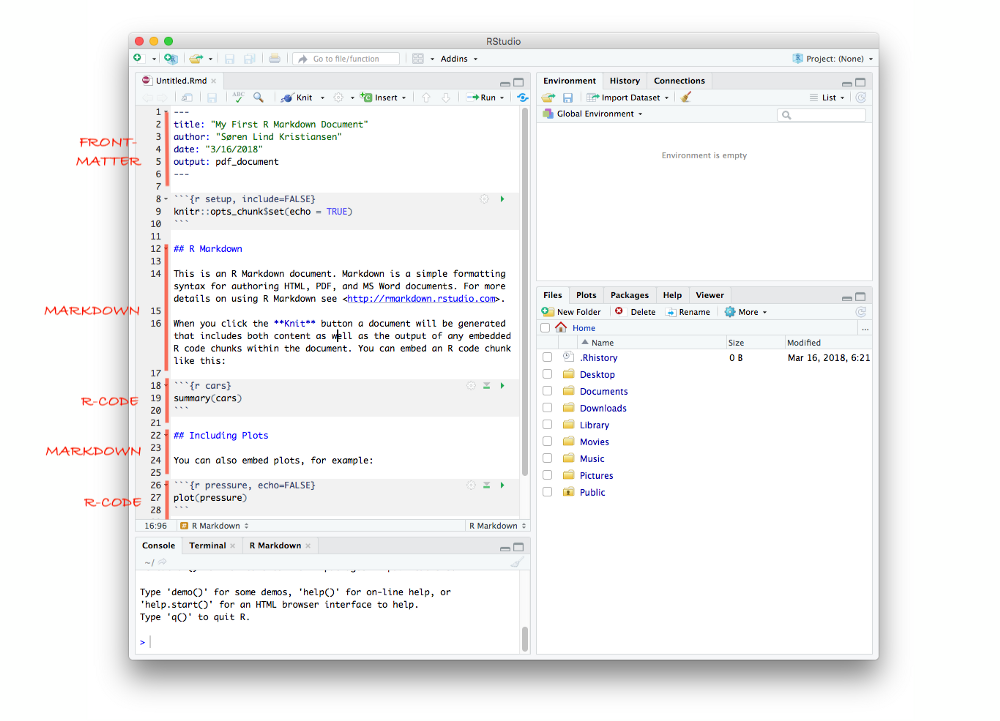

```{r setup, include=FALSE}
knitr::opts_chunk$set(echo = TRUE, message=FALSE, warning=FALSE,
                      comment="", digits = 3, tidy = FALSE, prompt = FALSE, fig.align = 'center')
```


---

# 클라우드 $\LaTeX$ 편집기 {#sharelatex}

[Overleaf](https://www.overleaf.com/) $\LaTeX$ 편집기는 과거 ShareLaTeX 서비스가 확대된 것으로 $\LaTeX$ 관련 저작물을 수월하게 클라우드 $\LaTeX$ 편집기능을 활용하여 저작할 수 있고 클라우드 특성상 공유와 협업도 자유로운 장점이 있다.


---

# TeXstudio 편집기 {#texstudio}

과거 `Texmaker`가 있었다면 이를 오픈 소스 $\LaTeX$ 편집기로 공개된 것으로 [TeXstudio](https://www.texstudio.org/)를 다운로드 받아 설치하여 자유로이 사용할 수 있다. GitHub [`texstudio`](https://github.com/texstudio-org/texstudio) 저장소에서 한국어 현지화의 도움도 기다리고 있다.


---

# RStudio IDE 편집기 {#rstudio-ide}

RStudio도 $\LaTeX$ 편집기로 활용하여 다양한 문서를 저작할 수 있다.




