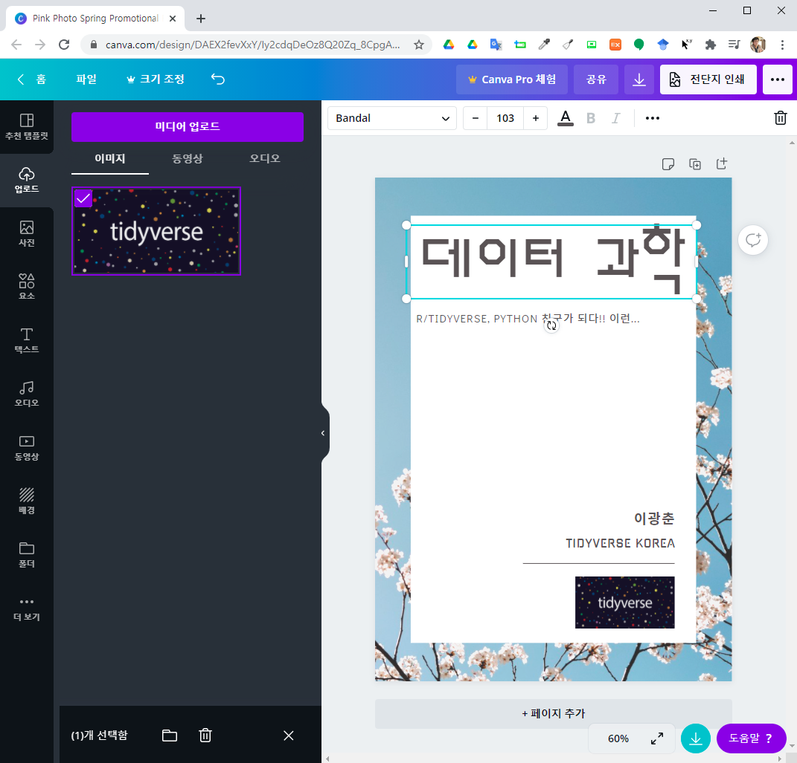

```{r setup, include=FALSE}
knitr::opts_chunk$set(echo = TRUE, message=FALSE, warning=FALSE,
                      comment="", digits = 3, tidy = FALSE, prompt = FALSE, fig.align = 'center')
```

```{=html}
<style>
div.blue { background-color:#e6f0ff; border-radius: 5px; padding: 10px;}
</style>
```

# 책표지 {#frontpage}

[`Canva`](https://www.canva.com/)와 같은 이미지 제작 웹사이트에서 책이나 보고서 첫페이지에 사용될 이미지를 제작한다. 제작한 파일을 `pdf` 파일로 저장한다.

{width="453"}

## 책표지 이미지 {#insert-image-with-title}

`titlepic` 팩키지를 동원해서 책제목과 함께 이미지를 함께 넣어 PDF 문서를 제작할 수 있다.
`titlepage`를 별도로 빼서 나름 모듈화 시킨다.

```{latex insert-image, eval = FALSE}
\documentclass[a4paper]{article}
\usepackage{kotex}
\usepackage{jiwonlipsum}

% 첫장
\usepackage{titlepic}
\usepackage{graphicx}

\title{데이터 과학 입문}
\author{이광춘}
\date{\today}
\titlepic{\includegraphics[width=7cm]{cover.png}}
%\titlepic{\includegraphics[width=\textwidth/2]{cover.png}}

\begin{document}
	
	\begin{titlepage}
		\maketitle
	\end{titlepage}

	\section{들어가며}
	\jiwon
	
\end{document}
```


---

``` {r embed-front-image-pdf, out.height = "460px", out.width='800px', echo=TRUE} 
knitr::include_graphics("lipsum/cover/cover-image.pdf")
```

## PDF 책표지 {#frontpage-pdf}

`pdfpages` 팩키지를 사용하면 `\includepdf[fitpaper]{canva-cover}` 명령어를 통해 간단하게 PDF 책표지를 넣어 멋진 책이나 보고서를 꾸밀 수 있다. 마찬가지로 `\includepdf[fitpaper]{canva-backmatter}` 명령어와 PDF 파일 뒷면을 준비한다.

```{latex pdf-cover-canva, eval = FALSE}
\documentclass[a4paper]{article}
\usepackage{kotex}
\usepackage{jiwonlipsum}

% PDF 겉장 -------------------------------
\usepackage{pdfpages}

\title{데이터 과학 입문}
\author{이광춘}
\date{\today}

\begin{document}
	
	\includepdf[fitpaper]{canva-cover}
	
	\begin{titlepage}
		\maketitle
	\end{titlepage}

	\section{들어가며}
	\jiwon
	
	\includepdf[fitpaper]{canva-backmatter}	
	
\end{document}
```

---

``` {r embed-cover-final-pdf, out.height = "460px", out.width='800px', echo=TRUE} 
knitr::include_graphics("lipsum/cover/cover-pdf.pdf")
```

윈도우즈 10 `canva` PDF 파일은 R마크다운과 함께 작업할 경우 잘 동작하지 않는 오류가 있다.

```{r download-pdf}
htmltools::a(href = 'lipsum/cover/cover-pdf.pdf', '다운로드')
```

# PNG 이미지 {#PNG-image}


