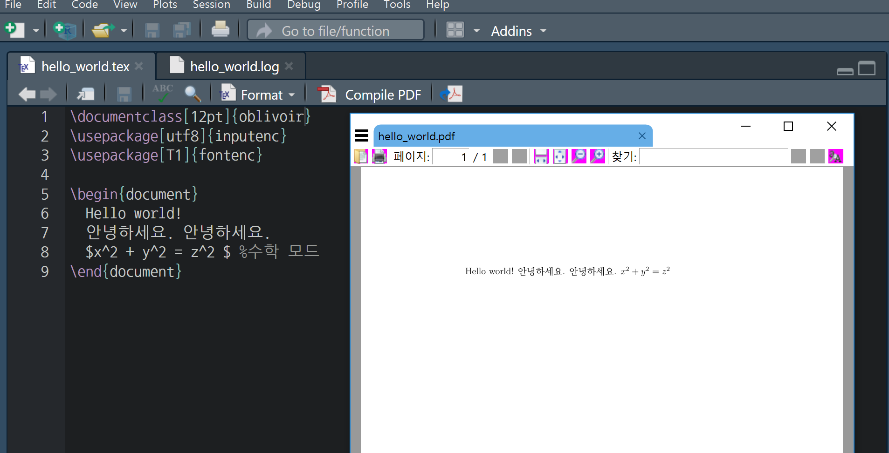
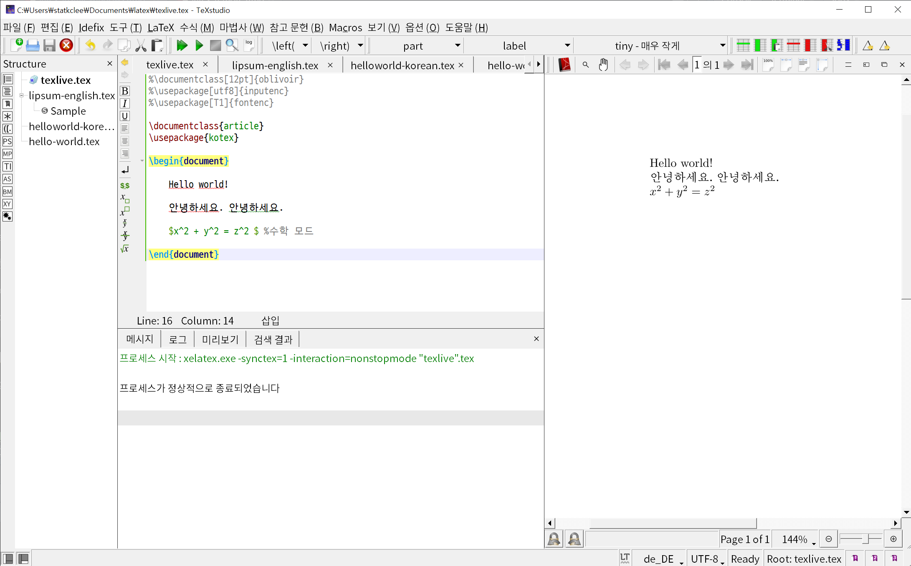
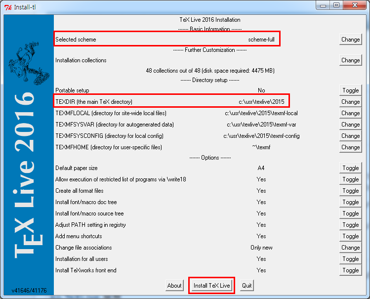
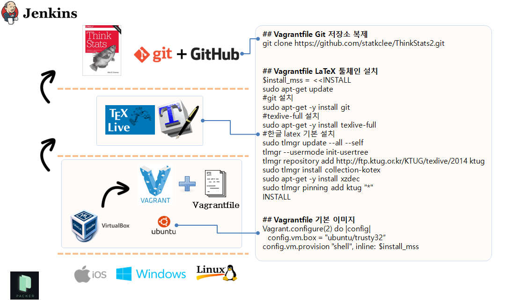

```{r setup, include=FALSE}
knitr::opts_chunk$set(echo = TRUE, message=FALSE, warning=FALSE,
                      comment="", digits = 3, tidy = FALSE, prompt = FALSE, fig.align = 'center')
```


```{=html}
<style>
div.blue { background-color:#e6f0ff; border-radius: 5px; padding: 10px;}
</style>
```

# 윈도우 10 환경 [^windows-10-install] {#windows-10-install}

[^windows-10-install]: [KTUG (2018-04-30), "설치하기Windows/tlinstall"](http://wiki.ktug.org/wiki/wiki.php/%EC%84%A4%EC%B9%98%ED%95%98%EA%B8%B0Windows/tlinstall)

[KTUG (2018-04-30), "설치하기Windows/tlinstall"](http://wiki.ktug.org/wiki/wiki.php/%EC%84%A4%EC%B9%98%ED%95%98%EA%B8%B0Windows/tlinstall)을 참고하여 설치 작업을 수행한다.

<iframe width="300" height="180" src="https://www.youtube.com/embed/V1Q6vEuoAQ0" frameborder="0" allow="accelerometer; autoplay; encrypted-media; gyroscope; picture-in-picture" allowfullscreen></iframe>


1. 사전준비
    - MiKTeX이나 TeXLive 이전 버전이 설치되어 있다면 프로그램 추가/삭제에서 지운다. 윈도우즈 사용자 이름을 영문자와 숫자만으로 한다.
1. TeXLive ~~2018~~ 2020 설치
    - [KTUG, "설치하기Windows/tlinstall"](http://wiki.ktug.org/wiki/wiki.php/%EC%84%A4%EC%B9%98%ED%95%98%EA%B8%B0Windows/tlinstall)
    - http://mirror.navercorp.com/CTAN/systems/texlive/tlnet/install-tl.zip 다운로드 
    - 압축을 풀고 intall-tl-YYYYMMDD라는 폴더로 들어간다.
    - command 명령창을 연다: `&#8862; + R` 을 누른후 `cmd`를 입력하고 enter를 누르면 DOS 시절과 같은 terminal 창이 뜬다.
    - `install-tl-advanced.bat` 를 입력하고 실행한다. `install-tl.bat`이나 `install-tl-windows.bat`가 아니라 `-advanced`를 실행하는 것을 권장한다. 설치되는 디렉토리를 기본값에서 바꾸어 설치할 필요가 있을 수도 있다.
        - 네이버: `install-tl-advanced.bat --repository http://mirror.navercorp.com/CTAN/systems/texlive/tlnet/`
        - KAIST: `install-tl-advanced.bat --repository http://ftp.kaist.ac.kr/tex-archive/systems/texlive/tlnet/`
        - KTUG: `install-tl-advanced.bat --repository http://ftp.ktug.org/tex-archive/systems/texlive/tlnet/`
    - Directory Setup 부분의 TEXDIR가 `c:\texlive\2018`로 되어 있는 것을 `c:\usr\texlive\2018`로 고친다. 먼저 윈도우 탐색기를 열고 `c:\usr\texlive\2018` 디렉토리를 생성시킨 후 진행한다.
    - Selected scheme이 scheme-full로 되어 있다. 원하는 것을 선택한다. 시간이 오래 걸리더라도 scheme-full 설치하는 것이 사후관리를 위해서나 정신건강을 위해서나 좋다.
    - `Install TeXLive` 버튼을 누르고 기다린다. (시간이 많이 걸린다 30분이상)
1. 환경변수 설정
    - [내컴퓨터 - 속성] 또는 [제어판\시스템 및 보안\시스템] 에서 왼쪽의 '고급 시스템 설정' 으로 들어갑니다. 혹은 Windows 설정에서 "설정 찾기" 검색창에 '고급 시스템 설정'을 입력합니다.
    - 시스템 속성 창입니다. '환경 변수' 클릭
    - 시스템 변수의 '새로 만들기' 를 클릭하여 시스템 변수를 추가하거나, 사용자 변수에 추가합니다.
        -`C:\usr\texlive\2018\bin\win32` 혹은 `C:\texlive\2020\bin\win32`을 추가
1. [ko.TeX Live](http://wiki.ktug.org/wiki/wiki.php/koTeXLive) 설정
    - ko.TeX Live는 KTUG 표준한글텍환경 프로젝트팀이 KTS의 지원을 받아 제작하여 배포한 윈도우즈용 인스톨러였다.
    - TeX Live command-line(cmd 프로그램)을 열어서 다음 명령을 차례로 실행한다. (`>` 표시는 프롬프트이므로 직접 써넣는 것이 아님.)

```{r kotex-live-install, eval=FALSE}
> tlmgr repository add http://ftp.ktug.org/KTUG/texlive/tlnet ktug
> tlmgr pinning add ktug *
> tlmgr install ktugbin
> tlmgr install texworks-config
> tlmgr install nanumttf hcr-lvt
```

## Hello World {#latex-hello-world}

구글링해서 "latex hello world" 검색해서 `hello_world.tex` 파일로 저장시킨다.

```{r latex-hello, eval=FALSE}
# 파일명 hello_world.tex

%\documentclass[12pt]{oblivoir}
%\usepackage[utf8]{inputenc}
%\usepackage[T1]{fontenc}

\documentclass{article}
\usepackage{kotex}

\begin{document}
	
	Hello world!
	
	안녕하세요. 안녕하세요. 
	
	$x^2 + y^2 = z^2 $ %수학 모드
	
\end{document}
```

그리고 나서, 이를 RStudio에서 컴파일하게 되면 다음과 같이 한글도 정상 출력되어 PDF 파일이 생성되는 것이 확인된다.



TexStudio에서 동일한 $\LaTeX$ 코드를 컴파일시키게 되면 `\usepackage{kotex}` 의 도움으로 훨씬 깔끔하게 한글문서 작업을 수행할 수 있다.



# 윈도우 7 환경 $LaTeX$ 설치 {#windows-7}

윈도우 환경에서 $LaTeX$ 을 설치하는 것이 경우에 따라서는 꼬일 수가 있다. [KTUG Wiki](http://wiki.ktug.org/wiki/wiki.php/설치하기Windows/tlinstall)를 참조하여 설치한다.


<div class = "blue">

**사전 준비**

* MikTeX 혹은 TeXLive 이전 버젼이 설치된 경우 프로그램 추가/삭제에서 지운다.
* 윈도우즈 사용자 이름을 영문과 숫자로만 한정한다.

</div>


## TeXLive 2015 설치  {#windows-7-texlive}

1. [http://ftp.ktug.org/tex-archive/systems/texlive/tlnet/install-tl.zip](http://ftp.ktug.org/tex-archive/systems/texlive/tlnet/install-tl.zip) 사이트에서 다운로드 한다.
1. 다운로드한 압축파일을 풀고 예를 들어 `install-tl-20160711`와 같은 폴더로 들어간다. 
1. `install-tl-advanced.bat` 파일을 실행한다.
    * **GUI** 가 뜨지 않는 경우: 시스템 변수 `Path`에 `C:\Windows\system32;` 를 추가 
    * `Directory Setup`에 `TEXDIR`이 `c:\texlive\2015` &rarr; `c:\usr\texlive\2015`으로 수정한다. 만약, 디렉토리 수정이 되지 않는 경우 원인이 `c:\usr` 디렉토리가 존재하지 않기 때문에 발생된다. 따라서 `usr` 폴더를 `c:\` 루트 디렉토리 밑에 생성시킨다.
    * `Selected scheme` 이 `scheme-full`로 되어 있는지 확인한다. 
1. **Install TeXLive** 버튼을 누르고 한참 기다린다.
    * `scheme-full`을 선택했기 때문에 시간이 조금 더 걸리지만, 장기적으로 정신건강에는 최고로 좋다.




윈도우 쉘을 열고 `pdflatex --version` 명령어를 쳐서 다음과 같이 출력되면 정상이다.

```{r windows-7-check, eval=FALSE}
$ pdflatex --version

pdfTeX 3.14159265-2.6-1.40.17 (TeX Live 2016/W32TeX)
kpathsea version 6.2.2
Copyright 2016 Han The Thanh (pdfTeX) et al.
There is NO warranty.  Redistribution of this software is
covered by the terms of both the pdfTeX copyright and
the Lesser GNU General Public License.
For more information about these matters, see the file
named COPYING and the pdfTeX source.
Primary author of pdfTeX: Han The Thanh (pdfTeX) et al.
Compiled with libpng 1.6.21; using libpng 1.6.21
Compiled with zlib 1.2.8; using zlib 1.2.8
Compiled with xpdf version 3.04
```

# 한글 LaTeX 툴 체인 설치 {#korean-latex-toolchain}

한글 LaTeX 툴 체인을 가상환경에서 구축하기 위해서는 [Packer](https://www.packer.io/downloads.html)(패커), [VirtualBox](https://www.virtualbox.org/wiki/Downloads)(가상상자),  [Vagrant](https://www.vagrantup.com/downloads.html)(부랑자), [Git](https://git-for-windows.github.io/)(깃)과 필요에 따라서는 [Jenkins](https://jenkins-ci.org/)(젠키스)를 설치해야 된다.

만약 리눅스기반 운영체제를 사용한다면, [Docker](https://www.docker.com/)(도커)를 기반으로 해서 한글 LaTeX  툴체인을 구축하는 것도 가능하다.

::: {.blue}

**한글 LaTeX 가상환경 구축 도구**

*[Packer](https://www.packer.io/downloads.html)  
     - Control panel -> System -> Advanced System settings -> Environment Variables -> System variables : PATH  추가 
*[VirtualBox](https://www.virtualbox.org/wiki/Downloads)  
*[Vagrant](https://www.vagrantup.com/downloads.html)  
*[Git](https://git-for-windows.github.io/)
*[Jenkins](https://jenkins-ci.org/)

:::




## 부랑자(Vagrant) 환경 설정 {#vagarnt}

기본적으로 부랑자(Vagrant)는 가상상자(VirtualBox)를 가정하고 시작된다. 따라서 가상상자와 함께 부랑자를 함께 먼저 본인이 사용할 컴퓨터 운영체제에 맞춰 설치한다.

```{r init-vagrant, eval = FALSE}
$ vagrant init
$ ls
Vagrantfile
$ vagrant up
$ vagrant ssh
```

1. `vagrant init`  명령어는 boilerplate 혹은 skeleton  으로 불리는 `Vagrantfile`을 생성한다.
1. `nano Vagrantfile` 파일에 한글 LaTeX 설치 쉘스크립트를 복사하여 붙여넣는다.
1. `vagrant up` 명령어를 실행하면 기본 운영체제 `최신 우분투 64비트`와 함께 `LaTeX`(TexLive) 엔진과 함께 한글 설정, 그리고 HTML 생성을 위한 `hevea`도 함께 설치한다. 만약 운영체제나 기타 다른 부분에서 사용자정의가 필요한 부분은 자유로이 편집해서 **한글 LaTeX 작업용 가상 컴퓨터**를 설치하면된다.
1. `vagrant ssh` 명령어를 통해서 한글  LaTeX이 설치된 가상컴퓨터에 접속한다.
1. `git clone https://github.com/statkclee/ThinkStats2.git` 명령어를 입력하면 작업 프로젝트 파일을 가상컴퓨터 내부로 가져온다.
1. `cd ThinkStats2\book & make all` 명령어를 실행하면 `.tex` 파일을 컴파일 해서 `.pdf` 파일을 자동 생성한다.

## 한글 LaTeX 가상 컴퓨터 설치 설명 {#vm-explain}

### `texlive` 전체 엔진 설치 [^install-texlive] {#texlive-full-engine}

[^install-texlive]: [KTUG 위키 설치하기Linux/usermode](http://wiki.ktug.org/wiki/wiki.php/설치하기Linux/usermode)

LaTeX 전체 엔진 및 전체 팩키지를 설치한다. `sudo apt-get -y install texlive-full`, 
`sudo apt-get -y install  texlive-xetex, texlive-luatex, texlive-lang-cjk` 명령어를 통해서 한글을 처리하도록 관련 팩키지를 설치한다.

```{r install-texlive, eval = FALSE}
$ sudo apt-get -y install texlive-full
$ sudo apt-get -y install  texlive-xetex, texlive-luatex, texlive-lang-cjk
$ sudo apt-get install xzdec
$ tlmgr --usermode init-usertree
$ tlmgr repository add http://ftp.ktug.org/KTUG/texlive/tlnet ktug
$ sudo tlmgr pinning add ktug "*"
```


### 통계적 사고(Think Stats2) 의존성 설치 {#thinkstat-dependancy}

```{r install-thinkstat, eval = FALSE}
$ sudo apt-get -y install hevea
$ sudo apt-get -y install evince
```


## 한글 LaTeX 출판을 위한 `Vagrantfile` {#vagrant-for-latex}

아무것도 설치되지 않은 깨끗한 리눅스 새로운 가상 컴퓨터에 LaTeX 관련 팩키지를 설치하고 테스트하면서 마지막으로 살아남은 쉘명령어를 쉘스크립트 형태로 정리하고 이를  `Vagrantfile` 파일에 복사해서 적어 넣고 향후 반복해서 재사용한다. 이를 Git 같은 버젼제어시스템에 넣고 관리를 하게되면 특히 효과를 극대화할 수 있다.

```{r install-script, eval = FALSE}
$ install_mss = << INSTALL
sudo apt-get update
#install git
sudo apt-get -y install git

#install C dependencies
sudo apt-get -y install libacl1-dev libgnutls-dev gcc make
#install packaging dependencies
sudo apt-get -i install build-essential fakeroot lintian devscripts debhelper ubuntu-dev-tools cowbuilder
#install LaTeX Full version
sudo apt-get -y install texlive-full
#install Korean LaTeX Dependencies
# sudo apt-get -y install collection-kotex
# sudo apt-get -y install  texlive-xetex, texlive-luatex, texlive-lang-cjk
# 
sudo tlmgr update --all --self
tlmgr --usermode init-usertree
# tlmgr repository add http://ftp.ktug.org/KTUG/texlive/tlnet ktug
tlmgr repository add http://ftp.ktug.or.kr/KTUG/texlive/2014 ktug
sudo tlmgr install collection-kotex
sudo apt-get -y install xzdec
sudo tlmgr pinning add ktug "*"
# Think Stat2 Dependencies - translated from LaTeX to hevea
sudo apt-get -y install hevea
sudo apt-get -y install evince
INSTALL

Vagrant.configure(2) do |config|
  config.vm.box = "ubuntu/trusty32"
  config.vm.provision "shell", inline: $install_mss
end
```

# 실리콘(하드웨어) 위에 운영체제 설치 - 우분투 Packer 설치 [^1] {#install-silicon}

[^1]: [우분투 Packer 설치](https://www.digitalocean.com/community/tutorials/how-to-install-and-get-started-with-packer-on-an-ubuntu-12-04-vps)

`packer`를 다운로드한 후에 압축을 풀고 경로를 지정해 주어 어디에서든지 `packer` 명령어를 사용할 수 있는 것이 핵심이다.

1. 임의 명칭 디렉토리 생성한다. `packer`도 좋다.
1. `packer` 디렉토리로 이동한다.
1. `wget` 명령어로 

```{r install-packer, eval = FALSE}
$ mkdir packer
$ cd packer
$ wget https://releases.hashicorp.com/packer/0.8.6/packer_0.8.6_linux_amd64.zip
$ sudo unzip packer_0.8.6_linux_amd64.zip
$ nano ~/.bashrc
$ export PATH=$PATH:~/packer/
$ reboot # 혹은 source ~/.bashrc
```

## Packer를 사용한 VirtualBox 구축 {#packer-vm}

실리콘 위에 바로 Packer 를 사용해서 가상 컴퓨터를 생성하고 그 위에 한글 LaTeX 및 Git을 사용해서 응용프로그램을 개발하고 Jenkins를 사용해서 이를 바로 배포할 수 있다.

1. `packer build -only=virtualbox-iso application-server.json` 실행 
1. `cd virtualbox` 실행
1. `vagrant box add ubuntu-14.04.2-server-amd64-appserver_virtualbox.box --name devops-appserver` 실행
1. `vagrant up` 실행
1. `vagrant ssh` 명령어로 VirtualBox 접속

[참고자료:Udacity Intro to DevOps교육과정](https://www.udacity.com/wiki/ud611)


