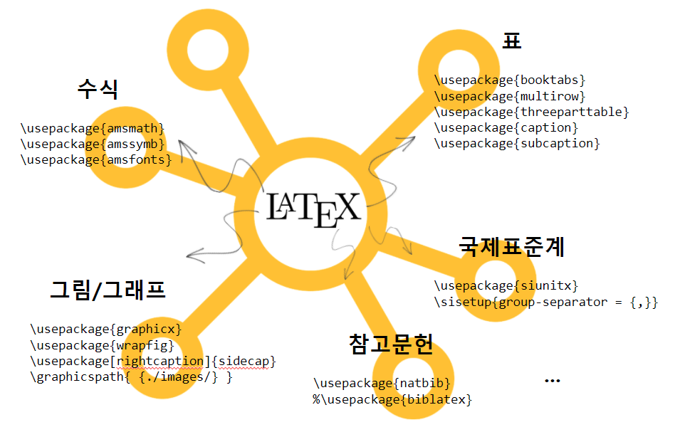

```{r setup, include=FALSE}
knitr::opts_chunk$set(echo = TRUE, message=FALSE, warning=FALSE,
                      comment="", digits = 3, tidy = FALSE, prompt = FALSE, fig.align = 'center')
```


```{=html}
<style>
div.blue { background-color:#e6f0ff; border-radius: 5px; padding: 10px;}
</style>
```



# 작업 구조 {#workflow-latex-packages}

`main.tex` 파일을 중심으로 각 `.tex` 파일과 `.png/.jpg` 이미지 파일을 각각 디렉토리를 만들어 저장하여 
복잡한 문서를 모듈화시켜 개발 생산성과 유지보수성을 높인다.

```{r latex-pdf-structure, eval = FALSE}
latex/
|-- main.tex
|-- biblatex-examples.bib
|-- secions/
    |-- 01_math.tex
    |-- 02_tables.tex
    |-- 03_graphics.tex
    |-- 02_si.tex
|-- images/
    |-- ggplot.png
    |-- gunchim.jpg
    |-- pororo.jpg
```


# 수식 [^overleaf-math] {#latex-kor-structure}

[^overleaf-math]: [Overleaf, "Mathematical expressions"](https://www.overleaf.com/learn/latex/mathematical_expressions)

수학 문서 작업을 위해서 많이 사용되는 수식관련 팩키지는 다음이 있다. 수식모드 `$$`에서 $\LaTeX$ 수식을 표현할 수 있다.

```{r latex-math, eval = FALSE}

\begin{verbatim}
	\usepackage{amsmath}
	\usepackage{amssymb}
	\usepackage{amsfonts}
	\usepackage[T1]{fontenc}
	\usepackage[urw-garamond]{mathdesign}
	\usepackage{garamondx}
\end{verbatim}


\subsection{면적 공식}

\begin{equation} \label{eq1}
	\begin{split}
		A & = \frac{\pi r^2}{2} \\
		& = \frac{1}{2} \pi r^2
	\end{split}
\end{equation}


\subsection{오일러 공식}

\begin{equation} \label{eu_eqn}
	e^{\pi i} + 1 = 0
\end{equation}

\subsection{수학 기호}

\begin{itemize}
	
	\item  \verb| \mathbb{N} | : $\mathbb{N}$
	\item  \verb| \mathbb{R} | :  $\mathbb{R}$
	\item  \verb| \Rrightarrow | :  $\Rrightarrow$
	\item  \verb| \therefore | :  $\therefore$
	\item  \verb| \bigstar | :  $\bigstar$ 
	
\end{itemize}
```


# 표 [^overleaf-table] {#table}

[^overleaf-table]: [Overleaf, "Tables"](https://www.overleaf.com/learn/latex/tables)

$\LaTeX$ 에서 다양한 표를 제작하고 멋지게 표현하는데 다양한 팩키지가 존재한다. 
경우에 따라서 페이지를 넘어가는 문서를 제작해야하는 경우 \verb*|threeparttable| 이 유용하다.

`\listoftables` 을 `\begin{document}` ... `\end{document}` 사이에 넣게 되면 표 목록을 일별할 수 있다.

```{r listoftables, eval = FALSE}
\begin{document}
...
  \listoftables
...
\end{document}
```

[Overleaf, "Tables"](https://www.overleaf.com/learn/latex/tables)에 제시된 표 몇개를 추려 $\LaTeX$으로 표현해보자.

```{r latex-table, eval = FALSE}
\usepackage{booktabs}
\usepackage{multirow}
\usepackage{threeparttable}
\usepackage{caption}
\usepackage{subcaption}

\subsection{간단한 표}

\begin{center}
	\begin{tabular}{ c c c }
		cell1 & cell2 & cell3 \\ 
		cell4 & cell5 & cell6 \\  
		cell7 & cell8 & cell9    
	\end{tabular}
\end{center}

\subsection{윤곽을 갖는 표}

\begin{center}
	\begin{tabular}{ |c|c|c| } 
		\hline
		cell1 & cell2 & cell3 \\ 
		cell4 & cell5 & cell6 \\ 
		cell7 & cell8 & cell9 \\ 
		\hline
	\end{tabular}
\end{center}

\subsection{TD, TR 구분된 표}

\begin{center}
	\begin{tabular}{||c c c c||} 
		\hline
		Col1 & Col2 & Col2 & Col3 \\ [0.5ex] 
		\hline\hline
		1 & 6 & 87837 & 787 \\ 
		\hline
		2 & 7 & 78 & 5415 \\
		\hline
		3 & 545 & 778 & 7507 \\
		\hline
		4 & 545 & 18744 & 7560 \\
		\hline
		5 & 88 & 788 & 6344 \\ [1ex] 
		\hline
	\end{tabular}
\end{center}

\subsection{표 제목과 캡션}

표 \ref{table:1} 은 \LaTeX 에서 참조하여 추적을 보여주는 한 사례다.

\begin{table}[h!]
	\centering
	\begin{tabular}{||c c c c||} 
		\hline
		Col1 & Col2 & Col2 & Col3 \\ [0.5ex] 
		\hline\hline
		1 & 6 & 87837 & 787 \\ 
		2 & 7 & 78 & 5415 \\
		3 & 545 & 778 & 7507 \\
		4 & 545 & 18744 & 7560 \\
		5 & 88 & 788 & 6344 \\ [1ex] 
		\hline
	\end{tabular}
	\caption{Table to test captions and labels}
	\label{table:1}
\end{table}

\subsection{고정폭 테이블}

\blindtext

\begin{table}[h!]
	\centering
	\begin{tabular}{ | m{5em} | m{1cm}| m{1cm} | } 
		\hline
		cell1 dummy text dummy text dummy text& cell2 & cell3 \\ 
		\hline
		cell1 dummy text dummy text dummy text & cell5 & cell6 \\ 
		\hline
		cell7 & cell8 & cell9 \\ 
		\hline
	\end{tabular}
	\caption{Fixed length 고정폭 표}
    \label{table:2}
\end{table}

\subsection{표선 굵기 조절 테이블}

\begin{table}[h!]
	\centering
	\begin{tabular}{ |p{3cm}|p{3cm}|p{3cm}|  }
		\hline
		\multicolumn{3}{|c|}{Country List} \\
		\hline
		Country Name     or Area Name& ISO ALPHA 2 Code &ISO ALPHA 3 \\
		\hline
		Afghanistan & AF &AFG \\
		Aland Islands & AX   & ALA \\
		Albania &AL & ALB \\
		Algeria    &DZ & DZA \\
		American Samoa & AS & ASM \\
		Andorra & AD & AND   \\
		Angola & AO & AGO \\
		\hline
	\end{tabular}
	\caption{Line Length 선굵기 변경 표}
	\label{table:3}
\end{table}
```

# 이미지 [^overleaf-figures] {#insert-images}

[^overleaf-figures]: [Overleaf, "Inserting Images"](https://www.overleaf.com/learn/latex/Inserting_Images)

`graphicx` 팩키지와 다양한 구현을 도와주는 `warpfig`, `sidecap` 팩키지를 사용하여 이미지를 $\LaTeX$ 문서에 넣는다.

```{r latex-graphicx-pkg, eval = FALSE}
\usepackage{graphicx}
\usepackage{wrapfig}
\usepackage[rightcaption]{sidecap}
\graphicspath{ {./images/} }
```

이미지 디렉토리를 `\graphicspath{ {./images/} }`와 같이 `./images/` 디렉토리를 상대경로 지정하게 되면 $\LaTeX$ 문서에서 이미지 확장자 없이 그대로 넣어 사용이 가능하다.

```{r latex-graphics, eval = FALSE}
\subsection{뽀로로}

\blindtext[1]

\includegraphics[scale=0.3]{pororo}

\subsection{군침이 싹도노}

\blindtext[1]

\begin{SCfigure}[0.5][h]
	\caption{뽀로로의 친구 루피의 군침이 싹도노 명작}
	\includegraphics[width=0.3\textwidth]{gunchim}
\end{SCfigure}

\subsection{뽀로로 텍스트 크기}

\blindtext[1]

\begin{wrapfigure}{r}{0.1\textwidth} 
	\includegraphics[width=0.1\textwidth]{pororo}
\end{wrapfigure}

\subsection{뽀로로 사랑 ggplot}

\begin{figure}[t]
	\includegraphics[width=8cm]{ggplot}
	\centering
	\caption{ggplot 시각화 }
	\label{fig:ggplot}
\end{figure}

뽀로로가 사랑한 그림 \ref{fig:ggplot} 그래프를 알아보자.

\subsection{뽀로로 크기}

\blindtext

\begin{wrapfigure}{r}{0.25\textwidth} 
	\centering
	\includegraphics[width=0.25\textwidth]{pororo}
\end{wrapfigure}
```

# 참고문헌 {#reference}

```{r reference, eval = FALSE}
\usepackage{natbib}
%\usepackage{biblatex}
```


# 국제 단위계 {#si-standard}

국제단위계(Système international d’unités, 약칭 SI)는 도량형의 하나로, MKS 단위계(Mètre-Kilogramme-Seconde)이라고도 불린다. 국제단위계에서는 7개의 기본 단위가 정해져 있다. 이것을 SI 기본 단위(국제단위계 기본 단위)라고 한다. `siunitx` 팩키지를 사용하게 되면 국제단위 7개를 사용할 수 있다.

| 물리량 | 이름     | 기호 |
|:------:|:--------:|:----:|
| 길이   | 미터     | m    |
| 질량   | 킬로그램 | kg   |
| 시간   | 초       | s    |
| 전류   | 암페어   | A    |
| 온도   | 켈빈     | K    |
| 물질량 | 몰       | mol  |
| 광도   | 칸델라   | cd   |

```{r si-packages, eval = FALSE}
%% SI 국제 단위계
\usepackage{siunitx}
\sisetup{group-separator = {,}}
```

[Formatting SI Units](https://www.dickimaw-books.com/latex/thesis/html/siunitx.html)에 나온 사례를 그대로 구현하면 다음과 같다.

```{r si-example, eval = FALSE}
\subsection{숫자 간격}

\begin{itemize}
	\item 만단위 숫자 \verb*|\num{12890}| : \num{12890}
	\item 천단위 숫자 \verb*|\num{1289}|: \num{1289}
	\item 소수점 숫자 \verb*|\num{.346}|: \num{.346}
	\item 소수점 숫자 \verb*|\num{1.23e-6}|: \num{1.23e-6}
\end{itemize}


\subsection{각도}

\begin{itemize}
	\item 도형의 각도 \verb*|\ang{45}| : \ang{45}	
	\item 지도 위경도 \verb*|\ang{60;2;3}|: \ang{60;2;3}
\end{itemize}


\subsection{길이와 면적}

\begin{itemize}
	\item 거리 \verb*|\si{\kilo\metre}| : \si{\kilo\metre}	
	\item 면적 \verb*|\si{\kilo\metre\squared}|: \si{\kilo\metre\squared}
\end{itemize}

\subsection{가속도}

\begin{itemize}
	\item 가속도 \verb*|\si{\metre\per\square\second}|: \si{\metre\per\square\second}	
	\item 중력 가속도 \verb*|\SI{9.78}{\metre\per\square\second}|: \SI{9.78}{\metre\per\square\second}
\end{itemize}
```

# 기타 {#other-package}

$\LaTeX$ 문서 저작에 큰 힘이 되는 팩키지에 다음이 있다. 

```{r other-packages, eval = FALSE}
\usepackage{setspace}
\usepackage{microtype}
\usepackage{siunitx}

\usepackage{nomencl}
\usepackage{fancyhdr}\pagestyle{fancy}

\usepackage{hyperref}
\usepackage{cleveref}

\usepackage{titletoc}
\usepackage{titlesec}
\usepackage{tocloft}
\usepackage{mhchem}
\usepackage{footmisc}
\usepackage{longtable}
\usepackage{lscape}
\usepackage{array}
\usepackage{glossaries}
```

---

# PDF 결과물 {#pdf-result}


``` {r embed-packages-pdf, out.height = "460px", out.width='800px', echo=TRUE} 
knitr::include_graphics("lipsum/packages/main.pdf")
```
