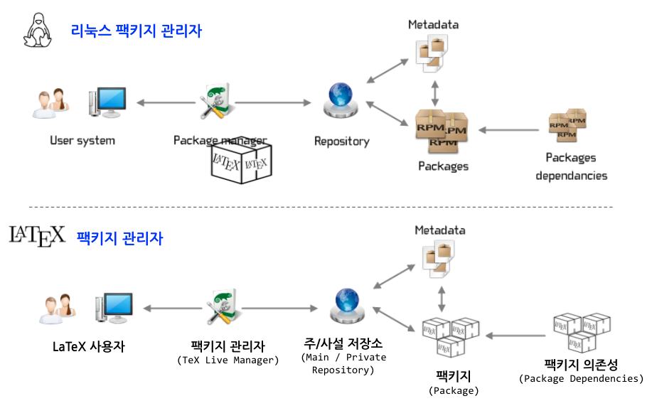

```{r setup, include=FALSE}
knitr::opts_chunk$set(echo = TRUE, message=FALSE, warning=FALSE,
                      comment="", digits = 3, tidy = FALSE, prompt = FALSE, fig.align = 'center')
```

```{=html}
<style>
div.blue { background-color:#e6f0ff; border-radius: 5px; padding: 10px;}
</style>
```


# `tex live` 팩키지관리자 [^1] {#tex-live-package-manager}

[^1]: 윤석천, 이주호 (2017), "텍라이브 매니저와 KTUG 사설 저장소", TeX: 조판, 그 이상의 가능성

$\TeX$ 엔진을 보좌하는 다양한 팩키지가 존재한다.
$\LaTeX$ 저작을 할 때 당연히 기본 $\LaTeX$ 기능외에도 제3자가 개발한 팩키지를 활용하여 $\LaTeX$ 저작물을 더욱 읽기 쉽고 가독성 높게 작성할 수 있다.

$\LaTeX$에서 많이 사용되는 팩키지 관리자는 $\TeX$ 라이브 매니저 즉, `tlmgr` 이다.
텍라이브 팩키지 관리자는 운영체제와 독립적으로 이용되며 팩키지와 폰트 꾸러미를 설치 삭제하는데 큰 도움을 준다.
리눅스 `package manager` 나 R `CRAN` 혹은 파이썬 `PIP` 혹은 GitHub 저장소를 통해 동일한 개념을 활용하여 생태계 각각을 풍성하게 하고 영향력을 높여나가고 있다.

한글 폰트 설치 사례를 들어, 과거 폰트꾸러미를 설치하는 것과 팩키지 관리자 사용하는 것을 비교해보자.

+------------------------------------------+------------------------------+
| 고수의 영역                              | 팩키지 관리자: `tlmgr`       |
+==========================================+==============================+
| 1.  폰트 꾸러미 설치                     | 1.  `tlmgr install nanumttf` |
| 2.  `updmap.cfg` 에 해당 `map` 파일 기록 |                              |
| 3.  `udpmap-sys` 실행                    |                              |
+------------------------------------------+------------------------------+

# `tlmgr` 팩키지 관리자 {#tlmgr-pkg-mgr}

`tlmgr info geometry` 명령어를 통해서 이미 설치된 $\LaTeX$ `geometry` 팩키지에 대한 정보를 확인할 수 있다.

```{bash tlmgr-pkg-mgr}
tlmgr info geometry
```

이외에도 `tlmgr` 다양한 명령어를 통해 다양한 팩키지 관련 작업을 수행할 수 있다. 
자세한 내용은 [Basic Usage of tlmgr, the TEX Live Manager](http://tug.ctan.org/info/tlmgrbasics/doc/tlmgr.pdf) 을 참조한다.
기본 사용법은 쉘에서 다음 방식을 사용한다. 즉, 팩키지에 대한 정보를 확인하고 팩키지를 검색하고 팩키지를 설치하고 시간이 지나 최신 팩키지를 갱신하고 팩키지를 삭제하는 작업 등이 포함된다.

`tlmgr [global options ] action [action-specific options] [operands]`

- `info`
- `search`
- `install`
- `update`
- `remove`
- `option`
- `path`


```{r embed-tlmgr-pdf, out.height = "460px", out.width='800px', echo=TRUE}
knitr::include_graphics("data/tlmgr.pdf")
```

# 한글 사설 저장소 {#tlmgr-pkg-repository}

`tex live`를 설치하게 되면 기본 주 저장소로 <http://mirror.ctan.org/systems/texlive/tlnet> 이 설정된다. 하지만 모든 팩키지가 기본 저장소에 등록된 것이 아니라서 한글의 경우 사설 저장소를 등록해서 필요한 팩키지를 설치해야 저작물 작성에 활용할 수 있다.

```{r check-repository, eval = FALSE}
$ tlmgr repository list
List of repositories (with tags if set):
        http://mirror.ctan.org/systems/texlive/tlnet (main)
```


한글 lipsum 을 위해서 [lipsum 팩키지 설치](https://statkclee.github.io/latex/latex-lipsum.html#3_%ED%95%9C%EA%B8%80_lipsum)를 해야 되는 경우가 대표적인 사례다.

```{bash add-private-repo}
tlmgr repository list
```


