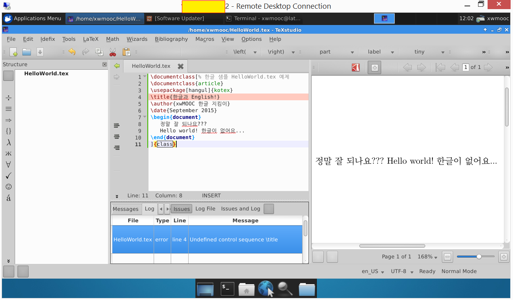

```{r setup, include=FALSE}
knitr::opts_chunk$set(echo = TRUE, message=FALSE, warning=FALSE,
                      comment="", digits = 3, tidy = FALSE, prompt = FALSE, fig.align = 'center')
```


```{=html}
<style>
div.blue { background-color:#e6f0ff; border-radius: 5px; padding: 10px;}
</style>
```


# $\LaTeX$ 설치 {#latex-install-help}

`texlive-full`만 설치하면 시간이 오래걸리고 용량을 많이 차지해서 그렇지만 기타 부수적인 설정을 할 필요는 없다. 다만 이미지 관련된 작업과 변환작업이 일부 있을 수 있어 `ghostscript`와 `imagemagick`을 추가로 설치한다.
한글을 LaTeX에서 구현하기 위해서는 texlive-xetex, texlive-luatex, texlive-lang-cjk 가 필요하다. 좀더 자세한 사항은 [KTUG 위키](http://wiki.ktug.org/wiki/wiki.php/설치하기Linux/usermode)를 참조한다.

```{r latex-full-install, eval = FALSE}
# LaTeX 설치
$ sudo apt-get install -y --no-install-recommends \
		texlive-full \
		ghostscript \
		imagemagick \
		texlive-xetex \
		texlive-luatex \
		texlive-lang-cjk
```

# 한글 $\LaTeX$ 편집기([texStudio](https://www.texstudio.org/)) [^1]

[^1]: [우분투에서 한글 Tex 환경 설치와 에디터 소개](http://slayer95.tistory.com/28)

LaTeX 문서를 개발을 도와주는 개발환경은 많이 있지만, 실행결과를 바로 확인해 줄 수 있는 `texworks`도 많이 사용되는 개발환경도구 중 하나다. 하지만 이제는 자리를 [texStudio](https://www.texstudio.org/)에 자리를 내어 준 것으로 보인다.

```{r texworks-install, eval = FALSE}
$ sudo apt-get install texworks
$ sudo apt-get install texstudio
```

---



# 한글 LaTeX 문서 생성 {#latex-workflow}

LaTeX 문서 컴파일은 다음 명령어를 통해서 실행한다. `xelatex HelloWorld.tex` 명령어를 실행하면 pdf 파일이 생성된다. `pdflatex` 명령어는 CJK 문자를 처리하지 못해 `xelatex` 엔진을 사용한다.

```{r latex-sample, eval = FALSE}
% 한글 샘플 HelloWorld.tex 예제 
\documentclass{article}
\usepackage[hangul]{kotex}
\title{한글과 English!}
\author{Tidyverse 한글 지킴이}
\date{September 2015}
\begin{document}

   정말 잘 되나요???
  
   Hello world! 한글이 없어요...
\end{document}
```

```{r latex-sample-compile, eval = FALSE}
$ xelatex HelloWorld.tex
```

::: {.blue}

**`LaTeX Error: 'biblatex.sty' not found` 오류 해결**


`texlive-full`을 사용하지 않고 필요한 것만 설치하는 경우 종종 다음과 같은 오류가 난다. 
이런 경우 당황하지 말고 해당하는 팩키지를 찾아 설치하면 된다.

```{r install-tex-install, eval = FALSE}
$ sudo apt-get install texlive-bibtex-extra
```

참조: [http://tex.stackexchange.com/questions/122559/unicode-math-and-tex4ht-with-utf-8-input](http://tex.stackexchange.com/questions/122559/unicode-math-and-tex4ht-with-utf-8-input)

:::

## 참고문헌 LaTeX 팩키지 설치 {#install-korean-bibtex}

한글 LaTeX 개발에 참고문헌 기능을 사용할 경우 `texlive-bibtex-extra` 팩키지를 꼭 설치한다.

```{r install-tex-install-error, eval = FALSE}
! LaTeX Error: File `biblatex.sty' not found.
```

```{r install-tex-install-fix, eval = FALSE}
$ sudo apt-get install texlive-bibtex-extra 
```
 
## 한글 LaTeX 팩키지 설치 {#korean-pkg}

한글 LaTeX 팩키지 설치가 되어 있지 않다고 오류가 나면 `sudo apt-get install ko.tex` 명령어를 통해서 한글 LaTeX 팩키지를 설치하면 한글을 사용할 수 있다.

```{r install-kotex-install-error, eval = FALSE}
! LaTeX Error: File `kotex.sty' not found.
```

```{r install-kotex-install-fix, eval = FALSE}
$ sudo apt-get install ko.tex
```


