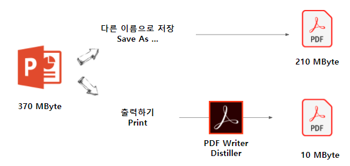
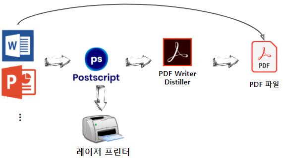

```{r setup, include=FALSE}
knitr::opts_chunk$set(echo = TRUE, message=FALSE, warning=FALSE,
                      comment="", digits = 3, tidy = FALSE, prompt = FALSE, fig.align = 'center')
```

```{=html}
<style>
div.blue { background-color:#e6f0ff; border-radius: 5px; padding: 10px;}
</style>
```
# PDF [^1] {#pdf-file}

[^1]: ["How did the PDF file format become the de facto standard for document publishing?", Quora](https://www.quora.com/How-did-the-PDF-file-format-become-the-de-facto-standard-for-document-publishing)

PDF는 이동 가능 문서형식으로 번역되며 Portable Document Format의 약자기도 하지만 파일명이기도 하다.
PDF 파일에는 일반 문서 및 문자, 도형, 그림, 글꼴이 포함된다.
아도브(Adobe)에서 1993년에 개발한 전자 문서 형식이자 국제 표준(ISO) 문서 형식(ISO 19005)으로 어느 환경에서나 동일한 결과물을 보여주기 위해 개발되어 사실상 문서를 주고 받을 때 사용하는 표준으로 자리잡았다.
좀더 쉽게 PDF는 컴퓨터 환경에 관계없이 같은 표현을 하기 위한 목적으로 개발되었고, 장치 독립성 및 해상도 독립성을 가진다라고 이해할 수 있다.
`pdf`는 어디까지나 출력해서 얻는 '인쇄물'이라 이를 편집하기 위해서는 전용 소프트웨어가 따로 필요하다.
윈도우에서는 `PDF Writer Distiller`, 리눅스에서는 `PDF Studio`가 대표적이다.

`.pdf`가 사실상의 표준이 되기 이전 팩스기에서 나온 `TIFF` 파일, 아도브 자사 포스트스크립트(`.ps`), AT&T 연구소에서 도서관의 도서나 각종 문서보관을 위햇 개발된 DuVu 프로젝트에서 나온 `.djv`, `.djvu` 등이 있었지만 결국 `.pdf` 파일로 정리되었다.


# PDF 리더와 `distiller` [^2] {#pdf-reader-write}

[^2]: [Brailsford (2016-10-01), "PDF Workflow - Computerphile", Computerphile](https://www.youtube.com/watch?v=-cFOsAzigyQ&t=5s)

파워포인트 파일 크기가 370 메가바이트로매우 크지만 이를 "다른 이름 저장"을 통해 PDF로 변환시키게 되면 크기를 다소 줄일 수 있지만, PDF Writer `distiller`로 변환시킬 경우 크기를 획기적으로 줄일 수 있다.



레이저 프린터로 고화질 출력을 할 경우 포스트스크립트(Postscript)를 사용해서 레이저 프린터로 출력할 수 있다.
이를 다시 PDF Writer `Distiller`를 사용해서 PDF 파일을 제작할 수 있고 현재는 기술이 많이 발달해서 워드, 아래한글 등 다양한 문서 저작 편집기를 사용해서 바로 PDF 파일을 제작할 수 있다.


