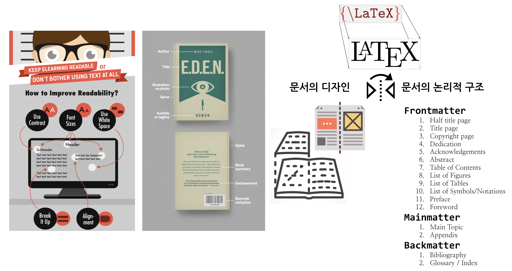
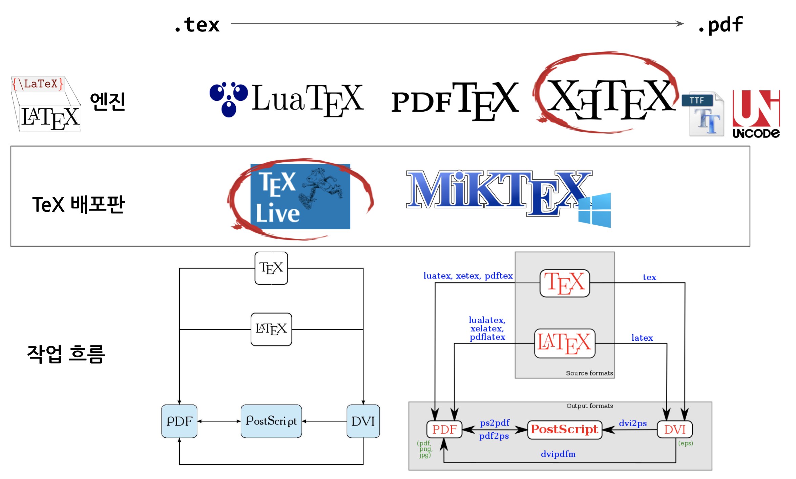

```{r setup, include=FALSE}
knitr::opts_chunk$set(echo = TRUE, message=FALSE, warning=FALSE,
                      comment="", digits = 3, tidy = FALSE, prompt = FALSE, fig.align = 'center')
```


```{=html}
<style>
div.blue { background-color:#e6f0ff; border-radius: 5px; padding: 10px;}
</style>
```


# $\LaTeX$ 철학 [^1] {#latex-philosophy}

[^1]: 김영록 (2017) "교육 현장에서의 텍의 활용", $\TeX$ : 조판, 그 이상의 가능성

$\LaTeX$은 한마디로 정의하게 되면 **"논리적인 디자인"**이라고 볼 수 있다. 저작물이 만들어지는 과정은 저작자가 원고를 손으로 쓰거나 타자기로 쳐서 출판사에 넘겨주면, 출판사의 편집디자이너는 원고를 보고 세부적인 출력형식을 결정하여 인쇄소에 넘긴다. 인쇄소는 이를 토대로 과거 식자공이 식자판을 만들었다면 현재는 컴퓨터가 파일을 만든다. $\LaTeX$ 과 $\TeX$ 이 하는 업무가 다소 차이가 난다.

- $\LaTeX$ 은 편집디자이너에 해당되는 업무를 수행
- $\TeX$ 은 식자공에 해당되는 업무를 수행



컴퓨터를 활용하여 전자조판을 넘긴 이유는 문서를 좀 더 읽기 쉽게 만들어 독자에게 저작자의 생각을 잘 이해시키는 것이다. 이러한 목적을 달성하기 위해서는 문서의 디자인이 그 문서의 논리적 구조를 잘 반영시켜야 하고, 반대로 문서의 논리적 구조를 잘 반영시키기 위해서는 문서 디자이너가 문서의 논리적 구조를 잘 이해해야만 된다. $\LaTeX$의 명령어는 기본적으로 **문서의 논리적 구조를 기술**하는 것이다. 이렇게 기술된 명령어를 $\TeX$으로 전달하여 조판하게 되어 원하는 최종 결과물을 얻게 된다.

$\LaTeX$에서 채택하는 논리적 디자인의 가장 큰 장점은 글을 더 잘 쓰게 된다는 점에 있다. $\LaTeX$ 으로 글을 작성하게 되면 점점 $\LaTeX$이 채택하고 있는 논리적 디자인에 맞추게 되고 이를 통해서 글쓰기 실력이 향상된다.

아마도 $\LaTeX$의 가장 큰 장점은 자동화에 있다. 시각적 디자인(Wysiwig)을 채택하여 작성한 문서를 다른 형식으로 변환하거나 문서의 수식의 일련번호를 로마자에서 아라비아 숫자로 모두 변경시키거나 표나 그래프 번호를 일괄번경하는 등 이러한 사례는 자주 발견된다. 특히, 국내외 저널에 제출할 논문을 $\LaTeX$ 으로 작성한 경우 템플릿만 바꾸면 쉽게 고품질 논문을 만들 수 있는데 워드를 이용하여 작성할 경우 수작업을 하게 되어 비생산적인 시간낭비도 크고 미려한 문서를 얻을 수도 없다.

따라서, $\LaTeX$ 으로 글을 쓰게 되면 글쓰기 본질에 집중할 수 있어 저작자의 생각과 의견을 좀더 진솔하게 가감없이 독자에게 전달시킬 수 있게 된다.

# 시각적 디자인 {#wysiwyg}

문서를 논리적으로 디자인하는 반대 개념으로 있는 것이 **위즈윅(WSYIWIG, What You See Is What You Get)** 으로 대표적인 것이 아래한글, MS 워드와 같은 워드 프로세서다. 시각적 디자인을 하게 되면 논리적이지 못한 애매한 조판을 하기 쉽다. 또한, PDF 파일로도 출력을 할 때 미세하나마 출력물에 일관성이 실종되기도 한다.


# $\LaTeX$ 엔진 [^2] {#latex-engine}

[^2]: 이호재 (2017), "레이텍을 빨리 쓸 수 있는 방법", $\TeX$ : 조판, 그 이상의 가능성

$\LaTeX$ 을 실제 문서작성에 사용하기 위해서는 텍 배포판을 선택해야 하는데 [KTUG 한국 $\TeX$ 사용자 그룹](http://www.ktug.org/)에서 $ko.TeX$ Live를 추천하고 있다. 이유는 다음과 같다.

- pdfLaTeX, XeLaTeX, LuaLaTeX 3종 $\LaTeX$ 엔진이 있는데 XeLaTeX 이 유니코드 텍 엔진이라 CJK 동아시아권 언어를 잘 지원하고 트루타입 및 오픈타입 폰트도 자유롭게 선택할 수 있기 때문에 인기가 많다.
- 운영체제에 따라 차이가 나지만 안정적으로 $\LaTeX$ 을 설치하여 실제 문서작업에 이용하기에는 $\TeX$ Live 가 MikTeX 보다 안정성이나 여러가지 사용자 지원 측면에서 낫다.
- $\TeX$ 소스파일에서 PDF 파일로 탐색을 하던가 반대로 PDF 파일에서 $\TeX$ 소스파일로 탐색을 하게 되는 기능을 TexStudio IDE를 활용하여 바로 가능하게 됨

과거 `latex+divps+pspdf` 를 활용한 가장 전통적인 작업흐름을 가졌다. 즉, `pstricks`를 활용하여 PDF 파일을 제작하는 방식으로 시간이 오래 걸리고 이미지로 `eps` 파일만 사용한다는 한계가 있다. 또 다른 `latex+dvipdfmx` 작업흐름은 중간에 `.dvi` 파일을 생성하고 `dvipdfmx`를 사용하여 PDF 파일을 제작하는 방식이다. 마지막으로 pdfLaTeX, XeLaTeX, LuaLaTeX 을 활용한 작업흐름이 있는데 `.tex` 소스파일에서 `.pdf` 파일을 즉시 생성한다는 점에서 인기가 있다.

이외에도 논문 제작이 아닌 문서를 제작하는 경우 한단계 더 들어가 `memoir` 혹은 `oblivoir` 클래스를 이용하는 것이 이미 검증된 문서 템플릿을 바탕으로 PDF 문서를 뽑아내는 신속한 방법이다.



# 참고 웹사이트 {#latex-reference}

- [경기과학고 $\LaTeX$ 사용자 협회](http://latex.gs.hs.kr/)

